## 文件导览
- 接口类实现：**`KICachePolicy.h`**
- 基础缓存算法实现：**`KLruCache.h`**、**`KLfuCache.h`**
- 高级缓存算法ARC(Adaptive Replacement Cache)：**`KArcCache.h`**、**`KArcLruPart.h`**、**`KArcLfuPart.h`**、**`KArcCacheNode.h`**
- 最终验证与调用：**`testAllCachePolicy.cpp`**
## 学习路线与知识点
- **`KICachePolicy.h`** 中可以学习：虚函数、接口规范、虚函数析构
- `KLruCache.h` 中可以学习：智能指针与内存管理、并发与RALL锁管理
- **`KLfuCache.h`** 中可以学习：“频率桶”，LFU中的降权机制与方法
- **`ARC的一系列文件`** 中可以学习：如何利用元数据 (Metadata) 探测缓存边界，实现容量自适应调整，组合 LRU 和 LFU 组件工作
- **`testAllCachePolicy.cpp`** 中可以学习：循环扫描；热点扫描：**`Zipf` 分布**：模拟互联网真实的“二八定律”热点访问
## 项目背景
### 缓存：
缓存是将**高频访问数据**暂存到内存，即一种加速数据访问的存储->cache，这种存储降低了延迟，提高了吞吐量。
### Why 缓存系统：
通过牺牲一部分服务器内存，减少对磁盘或数据库资源直接进行读写(IO操作)。这种用空间换时间的做法，可换取更快的响应速度，尤其是在高并发场景下，缓存可以负责存储经常访问的数据，通过设计合理的缓存机制提高资源的访问效率。
由于服务器内存有限，需要设计一种缓存淘汰策略，在内存超过一定标准时选择淘汰哪些无用数据。
### 什么地方需要缓存：
如图所示有多级缓存架构（Multi-Level Caching Architecture），核心思想是通过在数据传输的每一个环节设置“关卡”（缓存），尽可能地阻挡请求直接到达数据库，从而减轻数据库压力并提高响应速度。
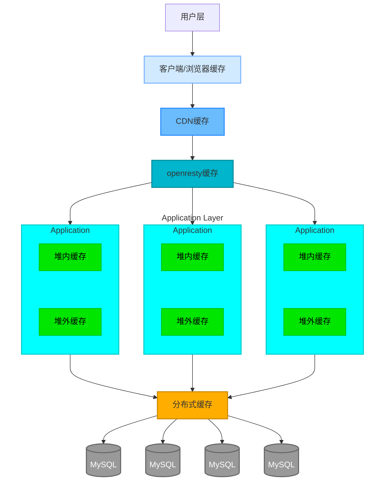
一个网站为了提高性能，可以有：
- **客户端/浏览器缓存**：距离用户最近的缓存，当访问网站，浏览器保存图片等静态资源，下次再访问可以直接读取资源，而不用网络请求。
- **CDN缓存**：[CDN即内容分发网络](https://zh.wikipedia.org/wiki/%E5%85%A7%E5%AE%B9%E5%82%B3%E9%81%9E%E7%B6%B2%E8%B7%AF) 将网站数据缓存到距离用户最近的服务器上，避免远距离的网络请求。
- **OpenResty/代理服务器缓存**： 反向代理服务器部署在应用服务器之前，用于拦截用户流量，如果发现用户请求有缓存（静态资源或网页快照），可以直接返回，而不进入后端请求。
- **应用层缓存**：应用服务器内代码逻辑运行的地方，分为**堆内缓存**与**堆外缓存**，这些缓存统称为进程内缓存，存储了如：极高频访问且很少修改的“配置类”数据、或“计算昂贵”的中间结果、瞬时“热点”数据，避免热度过大导致的后台崩溃。
- **分布式缓存**：如Reids或Memcached等独立部署的缓存系统。分布式缓存用于数据共享，由于是多台机器组成的集群，其拥有大容量的存储，同时可以保护数据库，维持应用服务的无状态化：即使应用服务器掉线，数据也有分布式系统保存维护。
- **MySQL**：所有数据存储的数据库，如果所有缓存层都没有找到数据，才会落到数据库寻找回传。
**缓存的顺序**：用户请求->HTTP缓存->CDN缓存->代理服务器缓存->进程内缓存->分布式缓存->数据库
### 距离用户越近，缓存能发挥更好的效果。
在浏览器层解决问题，消耗的资源是 0（对服务器而言）。
在数据库层解决问题，消耗的资源是巨大的（I/O、CPU）。
- 用户的请求从上至下。
- 每一层缓存都是一次拦截筛选。
- 如果数据在某一层找到了（**命中/Hit**），就直接返回给用户，**流程结束**。
- 如果没找到（**未命中/Miss**），请求才会漏到下一层。
## 缓存淘汰策略
### **FIFO（First In First Out）**
   先进先出算法：最为简单，按照页面进入顺序来决定替换哪个页面，不考虑是否被**频繁访问**。因此FIFO会导致Belady异常，即随着分配给进程的物理块数增加，缺页次数反而增加。
### **LRU（Least Recently Used）**
   最近最少使用算法：借鉴**时间局部性原理**，如果一个数据最近被访问过，那么将来被访问的可能性也较大，因此选择**最长时间未被访问**的页面进行替换。
   LRU最接近OPT（最佳置换算法），但对于频繁访问的页面更新开销较大。
   同时LRU算法存在问题：会导致**热点数据淘汰**，即有个数据在1个小时内的前59分钟访问了1万次，但在最后1分钟没有被访问，即被淘汰。
   LRU算法可以被优化为：LRU-K算法，HashLRU算法
### **LFU（Least Frequently ）**
   最不经常使用算法：借鉴**概率思想**，最近使用频率高的数据大概率将被再次使用，因此选择使用频率最小的数据置换。
   LFU算法有很多可以被**优化**的点：
   - 频率爆炸问题（热点数据长期驻留导致无限增长）
   - 过时热点数据占用缓存（一些数据已经不是热点数据，但访问频率太高而不会被删除）
   - 冷启动问题（刚加入缓存的项因为频率低、交换高而被快速淘汰，即便是热点数据）
   - 不适合短期热点（短期热点数据响应较慢，可能导致无法及时缓存）
   - 缺乏动态适应性（固定的LFU策略难以适应不同的应用场景或工作负载）
   - 锁的粒度过大，多线程高并发访问下锁的同步等待时间过长
   LFU算法可以被优化为：限制最大平均访问次数限制、HashLFUcache
###  **ARC（Adaptive Replacement Cache）**
   #### **核心思想**
   当访问的数据趋向于访问最近的内容，则更多命中LRU list，增大LRU空间；当系统趋向于访问频繁访问的内容，则更多命中LFU list，增大LFU空间。
   #### **应用场景**
   由于可以动态调整缓存分区大小，主要应用于不同的访问模式。
   #### **解决痛点**
   - LRU 的痛点：无法区分“只访问一次的过客”和“长期会被访问的常客”。
   - LFU 的痛点：LFU 适应模式变化的能力很差，且维护计数器开销大。
   ARC 的本质是在 **Recency（最近访问性）** 与 **Frequency（访问频率）** 之间建立动态平衡。它摒弃了固定的缓存分配策略，通过追踪“被错误淘汰的数据”（幽灵列表），自适应地调整缓存资源在“新数据”与“热点数据”之间的分配比例，从而同时具备抗扫描能力与热点保护能力。
   #### **核心数据结构：双层四表体系**
   ARC 将缓存空间总容量设为 $c$，并维护两个主要的逻辑集合 $L_1$ 和 $L_2$，每个集合被进一步划分为**驻留集（T）**和**幽灵表（B）**：
- **$L_1$ 集合（捕获 Recency）：**
    - **$T_1$ (Top 1):** 存放**最近只被访问过 1 次**的实际数据页面（缓存命中）。
    - **$B_1$ (Bottom 1):** 存放**刚从 $T_1$ 中被淘汰**的页面元数据（不存数据，仅存 Key）。这代表了“最近访问过但因容量不足被牺牲的新数据”。
- **$L_2$ 集合（捕获 Frequency）：**
    - **$T_2$ (Top 2):** 存放**最近被访问过 $\ge$ 2 次**的实际数据页面（缓存命中）。
    - **$B_2$ (Bottom 2):** 存放**刚从 $T_2$ 中被淘汰**的页面元数据。这代表了“曾经频繁访问但因容量不足被牺牲的热点数据”。
 ####   **动态维护**
   **数据的晋升（L1 $\rightarrow$ L2）：** 任何在 $L_1$（包括 $T_1$ 和 $B_1$）中的数据一旦被再次访问，立即晋升至 $T_2$ 的头部（MRU端）。这意味着该数据通过了“频率测试”，被认定为具有长期价值。
   **幽灵表的反馈（Feedback Loop）：** 当发生缓存未命中（Cache Miss），但该数据存在于幽灵表（$B_1$ 或 $B_2$）中时，视为“**幽灵命中**” (Phantom Hit)**，这触发了 $p$ 的调整：
   - 命中B1-> LRU预测失败：说明$T_1$太小了，错误淘汰了近期还要用的数据，因此增大$p$，即扩大$T_1$缩小$T_2$，向LRU策略倾斜。
   - 命中B2 -> LFU预测失败：说明$T_2$太小了，错误淘汰了重要的热点数据，因此减小$p$，即扩大$T_2$减小$T_1$，向LFU策略倾斜。
   **自适应淘汰机制**：当需要腾出空间加载新数据时，ARC 依据当前的 $p$ 值决定淘汰 $T_1$ 还是 $T_2$ 的末尾数据：
   - 若$Size(T_1) > p$：淘汰$T_1$的LRU端到$B_1$。
   - 若$Size(T_2) \le p$：淘汰$T_2$的LRU端到$B_2$。
	   对于自适应淘汰机制的解释，为什么说是从$T_2$的LRU端淘汰到$B_2$，因为ARC利用LRU方法管理LFU，当$T_1$中的多次访问数据才会进入$T_2$，当$T_2$需要淘汰时，选择$T_2$中**最近最久未访问**的数据淘汰。因此称为$T_2$的LRU端。
## 源码知识点分析
### KICachePolicy.h
#### **内容**
接口模板，用于解耦不同类型的提取、不同方法但同一函数的调用。
#### **核心**
采用**泛型编程（Generic Programming）/静态多态** 的写法，定义模板类接口，保证后续不论采用LRU，LFU，ARC哪一种算法，都可以采用get函数进行提取。
同时采用**动态多态（Dynamic Polymorphism）** 的写法，在运行阶段，通过基类指针调用具体的实现逻辑
#### **泛型接口**
泛型接口变成采用模板类与虚函数结合，他们可以分开使用应对不同场景，也可以合并使用，形成**泛型接口设计**。
##### 虚函数 (Virtual Functions)/动态多态
###### **目的**
为了解决：面对不同的对象，同一个事件表现出不同的行为问题，即**行为多态问题**。虚函数更关注的是**逻辑灵活性**。
###### **场景**
在代码中定义了不同的动物类型，他们都要表现出$speak()$行为，如果传入的是$Dog$对象，那么表现出的是"汪"，如果传入的是$Cat$对象，那么表现出的是"汪"。而这一实现，在**编译的时候不需要知道具体是猫还是狗，程序跑起来（运行期）再决定。** 即采用一个基类指针进行实现：$makeItSpeak(Animal* ani)$
###### **代码实现**
``` c++
#include <iostream>
// 定义基类，实现接口
class Animal {
public:
	virtual void speak() { // 实现虚函数事件接口
		std::cout << "???" << std::endl;
	}
	virtual ~Animal() {} // 虚函数析构 这是基类定义中必要的
}
// 定义派生类
class Dog : public Animal { // 继承基类 实现类继承
public:
	void speak() override { // 重写基类事件
		std::cout << "汪！" << std::endl;
	}
}

class Cat : public Animal {
public:
	void speak() override {
		std::cout << "喵！" << std::endl;
	}
}
// 传递基类指针，在编译的时候不知道具体类型
void makeItSpeak(Animal * animalType) {
	animalType -> speak(); // 调用虚函数表，实现对应事件
}

int main() {
	Dog dog;
	Cat cat;
	makeItSpeak(&dog); // 输出"汪！"
	makeItSpeak(&cat); // 输出"喵！"
	return 0;
}
```
###### **底层原理**
- **虚函数表 (vtable)**：编译器会为每个包含虚函数的**类**生成一张表，里面存着这个类所有虚函数的地址。
- **虚函数指针 (vptr)**：每个**对象**里都有一个隐藏的指针，指向这张表。
- **运行期决议**：当你调用 `ani->speak()` 时，CPU 做的动作是：“拿到 `ani` 指针 -> 找到 `vptr` -> 查 `vtable` -> 找到 `Dog::speak` 的地址 -> 跳转执行”。
- **代价**：因为多了一次“查表”和“跳转”的操作，所以虚函数比普通函数稍微慢一点点。
###### 虚函数表与虚函数指针
**虚函数表**是属于“类”的：
	编译器在编译时，会为每一个包含虚函数的类创建一个虚函数表（$vtable$）
	对应到上述代码即：
		Animal的虚函数表：里面存的是 `Animal::speak` 的函数地址。
		Dog的虚函数表：里面存的是 `Dog::speak` 的函数地址。
		Cat的虚函数表：里面存的是 `Cat::speak` 的函数地址。
**虚函数指针**是属于“对象”的：
	当实例化一个派生类对象时，对象内部会自动隐藏生成一个虚函数指针（$vptr$）
		`Dog` 对象的 `vptr` 指向 -> **Dog 的虚函数表**。
		`Cat` 对象的 `vptr` 指向 -> **Cat 的虚函数表**。
		`Animal` 对象的 `vptr` 指向 -> **Animal 的虚函数表**。
当调用$makeItSpeak$函数时，实际实现了一个传参过程：
	调用``makeItSpeak(&Dog)``时，把 `Dog` 对象的地址传进去，赋给了基类指针 `animalType`。虽然指针类型是 `Animal*`，但它指向的内存块里，实际上是一个 `Dog` 对象。
执行$makeItSpeak$函数内部的$animalType -> speak()$时，程序实现以下逻辑：
	1. 根据传参得到的指针找到``Dog``的内存块.
	2. 读取该内存块中的$vptr$。
	3. 根据$vptr$找到``Dog``的虚函数表。
	4. 在虚函数表中找到`speak` 函数的地址，然后执行，输出“汪！”。
##### 模板类（Class Templates）/动态多态/泛型编程
###### 目的
模板是为了解决“同一份逻辑，面对不同的数据类型，不需要重复写代码”。 它关注的是**数据类型**（Data Type）的灵活性。
###### 场景
当需要实现一个容器类型，他的功能对于不同的数据类型是相同的，为避免重复书写代码，需要定义模板，将类型空出，便于后续根据实际情况生成具体代码。
###### 代码实现
```cpp
#include <iostream>
template <typename T>
class Box {
public :
	void set(T item) {
		this->item = item;
	}
	
	T get() {
		return item;
	}
private:
	T item;
};

int main() {
	Box<int> intBox; // 编译器根据输入的T现场生成了int代码
	Box<double> doubleBox;
	
	intBox.set(10);
	doubleBox.set(3.11114);
	
	return 0;
}
```
###### 底层原理
**实例化**：模板类本身不是代码，只有在实例化/声明变量的时候，编译器会利用实例化时声明的类型替换代码中所有的T，生成一个新的类。
**代码膨胀**：由于其底层原理是重新实例化，如果在项目中实例化了n个不同类型的模板，最终就会包含n份代码逻辑。
	如何缓解模板代码膨胀？
	答：提取与类型无关的代码，如指针操作、大小计算等，到非模板基类中。
##### 动态VS静态
|特性|虚函数 (Virtual Function)|模板类 (Class Template)|
|---|---|---|
|**核心目的**|实现**行为**的动态替换（算法策略切换）|实现**数据类型**的通用性（容器、通用算法）|
|**生效时间**|**运行期 (Runtime)**|**编译期 (Compile-time)**|
|**灵活性来源**|指针指向不同的子类对象|传入不同的类型参数 (`<int>`, `<string>`)|
|**性能损耗**|轻微（查 vtable 表 + 无法内联优化）|无运行时损耗（但在编译时会变慢，二进制体积变大）|
|**错误检查**|编译时只检查基本语法，运行时才可能崩溃|编译时如果类型不支持某些操作，直接报错（报错信息通常很长很难懂）|
|**能否分离实现**|声明在 `.h`，实现在 `.cpp` (推荐)|**通常全部写在 `.h` 头文件中** (因为编译器需要看到源码才能生成代码)|
##### 泛型接口
###### 目的
为了实现**数据类型**与**处理逻辑**的完全分离，采用模板类与虚函数的结合使用。
###### 场景
在该代码的场景中，**模板（静态多态）** 负责解决“存什么”，**虚函数（动态多态）** 负责解决“怎么存”。
- 模板：
	负责适应不同的**数据类型**，在编译时就已经完成了功能实现，避免为不同的数据类型实现不同的缓存类。
- 虚函数：
	负责适应不同的**算法策略**，比如：LRU/FIFO/LFU，在运行时利用虚函数表与虚函数指针完成功能实现，避免同样的实际功能，仅因为算法结构不同而重新实现接口。
###### 接口逻辑
**第一步：确定类型（静态阶段）** 当写下 `KICachePolicy<int, string>` 时，模板发挥作用。编译器会立刻生成一个**具体的、固定的基类**。 在这个基类里，所有的 `Key` 都被替换成了 `int`，所有的 `Value` 都被替换成了 `string`。 此时，虚函数的接口就变成了确定的样子：`virtual void put(int key, string value) = 0;`
**第二步：确定算法（动态阶段）** 程序开始运行。创建了一个指向这个基类的指针。 `KICachePolicy<int, string>* ptr = new LRUCache<int, string>();` 当调用 `ptr->put(1, "a")` 时，程序会查看 `ptr` 实际指向的是哪个子类对象（是 LRU 还是 FIFO），然后调用那个子类里具体的代码。

**简单总结结合方式：** 模板先把**类型**固定下来，生成一个专门针对该类型的基类；然后虚函数在这个基类上定义**接口**，让子类去实现具体的算法。
###### 代码实现
```cpp
template <typename Key, typename Value> // 模板类，支持任意类型的key和value
class KICachePolicy
{
public:
    virtual ~KICachePolicy() {};
    // 纯虚函数 
    // 这是一个不能被实例化的**抽象基类**。
    // 它强制要求所有子类必须实现这个接口，否则子类也会变成抽象类（编译报错）。
    virtual void put(Key key, Value value) = 0;
    virtual bool get(Key key, Value& value) = 0;
    virtual Value get(Key key) = 0;
};
```
###### 解决问题
它解决了“M 种数据类型 × N 种算法策略”的**组合爆炸**问题。
**假设有 3 种数据类型（`int`, `string`, `double`）** 和  **2 种算法（`LRU`, `FIFO`）**
**如果不结合（比如只用继承）：** 需要写 3 × 2 = 6 个具体的类：
- `Int_LRU`
- `Int_FIFO`
- `String_LRU`
- `String_FIFO`
如果增加一种数据类型，就得再写 2 个类。
**如果使用“模板 + 虚函数”结合：** 只需要写：
-  **1 个** 模板基类（定义接口）。
-  **2 个** 模板子类（`LRU<K,V>` 和 `FIFO<K,V>`，实现逻辑）。
**结论：** 这种结合极大地减少了代码量，同时保证了：
-  代码能处理任意数据类型（归功于模板）。
-  程序运行时能随意切换算法（归功于虚函数）。
### KLruCache.h
#### 内容
实现了基础LRU算法，以及利用继承的方法，实现了改进的LRU-K、HashLRU算法。
#### 核心
利用**现代 C++ (Smart Pointers + RAII)** 封装的，基于 **模板与虚接口 (Templates + Virtuals)** 设计的，支持 **高并发分片 (Lock Striping)** 和 **抗缓存污染 (LRU-K)** 的工业级缓存实现。
从细节上可以划分为：
##### 多态
利用**类继承**、**友元**两种方法，实现了高效的代码实现策略，同时利用友元机制，实现了类间访问。
##### 双向链表
利用`std::shared_ptr` 与 `std::weak_ptr` 的协同机制，没有手动 `new/delete` 节点，而是完全依赖智能指针的引用计数，利用 `weak_ptr` **打破了双向链表的循环引用 (Cycle Breaking)**。
##### RALL（Resource Acquisition Is Initialization）范式
利用栈对象的生命周期自动管理资源（锁）。
利用 `std::lock_guard<std::mutex>` 实现区间锁，避免了手动的内存管理，让栈对象自己管理生命周期。
##### 组合优于继承 (Composition over Inheritance)
利用**组合模式 (Composition)** 与 **装饰逻辑**，通过**组合**现有的 `KLruCache` 来实现新的逻辑（访问计数），而不是重写一套链表操作。
##### 分治Hash
在KHashLruCaches这一类中，为避免锁的颗粒度较大，采用了**Hash 路由**与**分治**的思想，将大缓存切分成小缓存，减小锁的粒度，实现了高并发高吞吐量场景下的缓存。
#### 友元
##### 定义
[友元wiki](https://zh.wikipedia.org/wiki/%E5%8F%8B%E5%85%83%E5%87%BD%E6%95%B0) 
在面向对象编程中，**友元函数**（friend function）是一个指定类（class）的“朋友”，该函数被允许访问该类中private、protected、public的资料成员。普通的函数并不能访问private和protected的资料成员，然而宣告一个函数成为一个类的友元函数则被允许访问private以及protected的资料成员。
友元函数的宣告可以放在类声明的任何地方，不受访问限定关键字private、protected、public的限制。一个相似的概念是友谊类。
友谊关键字应该谨慎使用。如果一个拥有private或者protected成员的类，宣告过多的友元函数，可能会降低封装性的价值，也可能对整个设计框架产生影响。
##### 代码实现
```cpp
#include <iostream>
using namespace std;

// 如果出现 A类对B类友元，但是B类还没有声明 那么需要前向声明
class B; // 前向声明

class A {
private:
	int a;
public:
	void set(const int & a) {
		this->a = a;
	}
	// 友元声明
	friend class B;
};

class B{
private:
	int b;
public:
	void set(const int & b) {
		this->b = b;
	}
	void get(const A & a, const B & b);
};

void B::get(const A & a, const B & b) {
	// 由于A类对B类的友元（单向授权），导致B类的成员函数可以访问A类的私有变量a
	cout << a.a << " " << b.b << endl;
}

int main() {
	A a;
	B b;
	a.set(10);
	b.set(50);
	b.get(a, b); // 10 50
}
```
#### 双向链表与强弱智能指针
##### 目的
利用`RALL（Resource Acquisition Is Initialization）`，即**资源获取即初始化**这一编程方法的原理，智能管理对象生命周期，避免了资源泄露问题。
RAII要求，资源的有效期与持有资源的对象生命周期严格绑定，即由对象的构造函数完成资源的分配（获取），同时由析构函数完成资源的释放。在这种要求下，只要对象能正确地析构，就不会出现资源泄露问题。
```cpp
// --- 没有 RAII ---
void badFunc() {
    int* p = new int(10); // 租房
    if (soemthing_wrong) {
        return; // 坏了！直接走了，没退房！这就叫内存泄漏。
    }
    delete p; // 必须手动退房，很容易忘。
}

// --- 使用 RAII (智能指针) ---
void goodFunc() {
    // std::shared_ptr 就是那个“神奇盒子”
    std::shared_ptr<int> p = std::make_shared<int>(10); 
    
    if (something_wrong) {
        return; // 放心走吧！
        // 即使在这里退出，p 这个盒子销毁时，会自动把里面的 int 内存释放掉。
    }
} // 函数结束，p 自动销毁，内存自动释放。
```
##### 实现
在RAII的编程中，采用智能指针来管理内存。
- 强指针：`std::shared_ptr`
	定义：`shared_ptr`使用引用计数，每一个`shared_ptr`的拷贝都指向相同的内存。在最后一个`shared_ptr`析构的时候，内存才会被释放。
```cpp
	std::shared_ptr<int> p1(new int(5));
	std::shared_ptr<int> p2 = p1; // 都指向同一内存。
	p1.reset(); // 因为p2还在，所以内存没有释放。
	p2.reset(); // 释放内存，因为没有shared_ptr指向那块内存了。
```
- 弱指针：`std::weak_ptr`
	定义：`std::shared_ptr`使用引用计数，所以有**循环计数**问题，为了打破循环，使用`std::weak_ptr`。`std::weak_ptr`是一个弱引用，只引用，不计数，如果一块内存被`shared_ptr`和`weak_ptr`同时引用，当所有`shared_ptr`析构了之后，不管还有没有`weak_ptr`引用该内存，内存也会被释放。所以`weak_ptr`不保证它指向的内存一定是有效的，在使用之前需要检查。
##### 智能指针代码实现
```cpp
std::shared_ptr<int> p1(new int(5));
std::weak_ptr<int> wp1 = p1; // 还是只有p1有所有权。

{
  std::shared_ptr<int> p2 = wp1.lock(); // p1和p2都有所有权
  if (p2) // 使用前需要检查
  { 
    // 使用p2
  }
} // p2析构了，现在只有p1有所有权。

p1.reset(); // 内存被释放。

std::shared_ptr<int> p3 = wp1.lock(); // 因为内存已经被释放了，所以得到的是空指针。
if（p3）
{
  // 不会执行到这。
}
```
##### 双向链表的智能指针实现
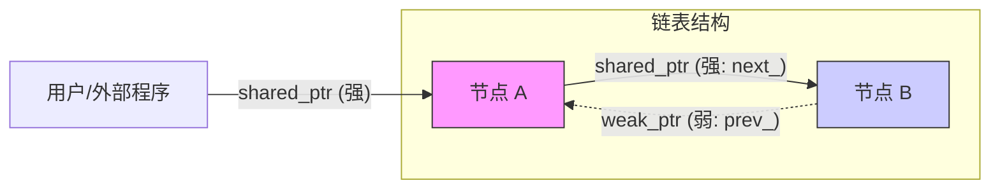
###### 双向节点
双向节点的设置，要求其**强引用后向指针**，**弱引用前向指针**。这种做法避免了：两者都是强引用的无法析构问题，同时根据自顶向下的管理模式，可以复合逻辑的管理整个链表，以及其中所有节点。
- **结构**：`List对象` -> (强) -> `Node A` -> (强) -> `Node B` -> (强) -> `Node C`
- **生存逻辑**：
    1. `List` 活着，所以它抓着的 `Head` (Node A) 活着。
    2. `Node A` 活着，它手里死死抓着 `Node B` (next 是强)，所以 B 活着。
    3. `Node B` 活着，它手里死死抓着 `Node C` (next 是强)，所以 C 活着。
- **结果**：只要抓住头节点，整条双向链表的所有双向节点都会存在，且其内存被正常管理。
**代码实现**
```cpp
#include <memory> // 智能指针库

template<typename T>
struct Node {
    T data;
    // 后向指针：强引用 (shared_ptr)
    // 只要我指着下一个节点，它就不能死。
    // "我拥有下一个节点"
    std::shared_ptr<Node<T>> next;
    // 前向指针：弱引用 (weak_ptr)
    // 我只看着上一个节点，如果它被别人删了，我不会拦着。
    // "我不拥有上一个节点，防止循环引用死锁"
    std::weak_ptr<Node<T>> prev;
    // 构造函数
    Node(const T& val) : data(val) {
        std::cout << "Node [" << data << "] created." << std::endl;
    }
    // 析构函数
    // 可以不写/不显示定义析构函数，编译器会默认的自下而上的析构。
    ~Node() {
    }
};
```
###### 双向链表实现
双向链表私有含有头尾指针，且头尾指针都是强引用，用于保护整个链表，即list保护头结点，才会有头结点保护后续所有节点。
**关于遍历**
- 如果**正向遍历**一个链表，由于都是强指针，因此可以直接遍历所有后续节点，因为当前节点的强指针会保证后一节点一定存在。
- 而**反向遍历**的情况下，就需要利用：`auto prevShared = curr->prev.lock();`去尝试获取前一节点是否存在，因为弱引用并不保证节点一定存在，如果不存在那么弱引用就是空指针。
**代码实现**
```cpp
template<typename T>
class ModernList {
private:
    std::shared_ptr<Node<T>> head_; // 头指针，强引用，拉住整条链表
    std::shared_ptr<Node<T>> tail_; // 尾指针，为了方便尾插，也用强引用

public:
	// 显式要求编译器生成默认构造函数，按照默认规则生成一个实现。
	// 按照成员变量类型的**默认行为**来初始化
	// 可读性强，也有编译优化的功能。
	// 老式写法：ModernList() {}
    ModernList() = default;
    // 整个链表的销毁是全自动的。
    ~ModernList() {
    }
    // --- 尾部插入 (Push Back) ---
    void push_back(const T& val) {
        // 1. 创建新节点 (类似于 new Node)
        auto newNode = std::make_shared<Node<T>>(val);
        // 2. 如果链表是空的
        if (!head_) {
            head_ = newNode;
            tail_ = newNode;
        }
        // 3. 如果链表不为空
        else {
            // 旧尾巴的 next 指向新节点 (强引用建立)
            tail_->next = newNode;
            // 新节点的 prev 指向旧尾巴 (弱引用建立)
            newNode->prev = tail_;
            // 更新尾巴指针
            tail_ = newNode;
        }
    }
    // --- 正向遍历 (使用 shared_ptr) ---
    void print_forward() {
        std::cout << "Forward: ";
        auto curr = head_;
        while (curr) {
            std::cout << curr->data << " -> ";
            curr = curr->next; // shared_ptr 自动传递所有权
        }
        std::cout << "nullptr" << std::endl;
    }
    // --- 反向遍历 (展示 weak_ptr 怎么用) ---
    void print_backward() {
        std::cout << "Backward: ";
        auto curr = tail_;
        while (curr) {
            std::cout << curr->data << " -> ";
            // 【核心重点 3】怎么使用 weak_ptr？
            // 不能直接用 curr->prev->data (因为 prev 是弱的，可能随时过期)
            // 必须先 lock() 把它临时变成强的
            auto prevShared = curr->prev.lock(); // 尝试获取前一个节点
            if (prevShared) {
                // 如果前一个节点还活着，就移动过去
                curr = prevShared;
            } else {
                // 如果 lock() 返回空，说明到头了
                break;
            }
        }
        std::cout << "nullptr" << std::endl;
    }
};
```
**如何析构**
在析构双向链表：`ModernList`的时候，链表：`A -> B -> C`。 
引用计数初始状态：
- **A**: 1 (来自 `head_`)
- **B**: 1 (来自 `A->next`)
- **C**: 2 (来自 `B->next` 和 `tail_`) 
由于成员变量的析构顺序是与声明顺序相反的，根据原先代码内写的：先析构`tail_`，后析构`head_`，因此整体析构顺序是：
- **List 开始析构**。
- **`tail_` 指针销毁**：
    - C 的引用计数从 2 减到 1。
    - **C 还没被完全析构**
- **`head_` 指针销毁**：
    - A 的引用计数从 1 减到 0。
    - **A 被完全析构！**
- **A 的析构函数触发**：
    - A 松开 `next` (指向 B)。
    - B 的引用计数从 1 减到 0。
    - **B 被完全析构！**
- **B 的析构函数触发**：
    - B 松开 `next` (指向 C)。
    - C 的引用计数从 1 减到 0。
    - **C 被完全析构！**
同样的，如果在写双向链表时，先声明`tail_`，后析构`head_`，就会出现双向节点$C$在`tail_`被析构时才会析构。
同时，由于整个双向链表的存在是由链表中的`head_`这一强引用保证的，因此可以不用声明`tail_`也完全成立，`tail_`的存在单纯保证了尾插的时间复杂度是`O(1)`。
#### LRU的实现
##### 流程图
**LRU基础框架**
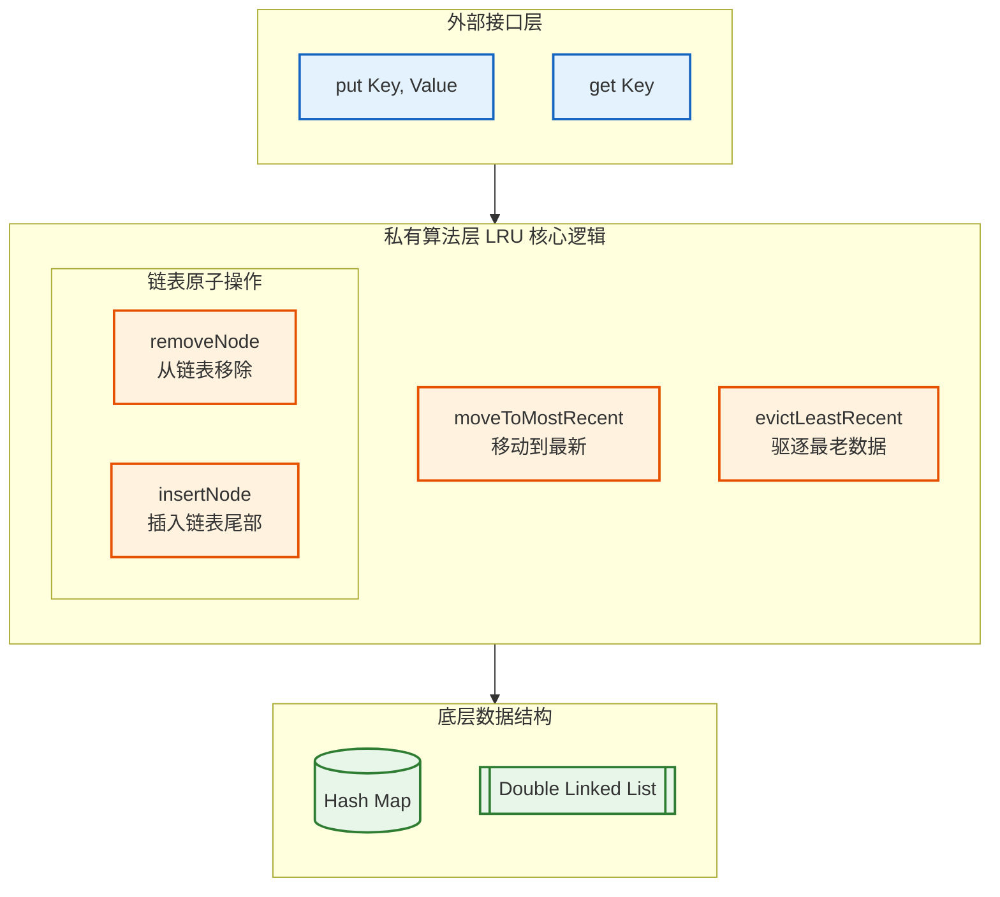
**读逻辑流程图**
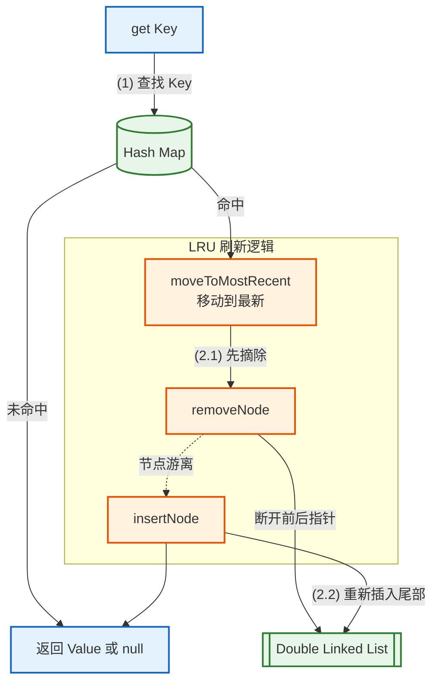
**写逻辑流程图**
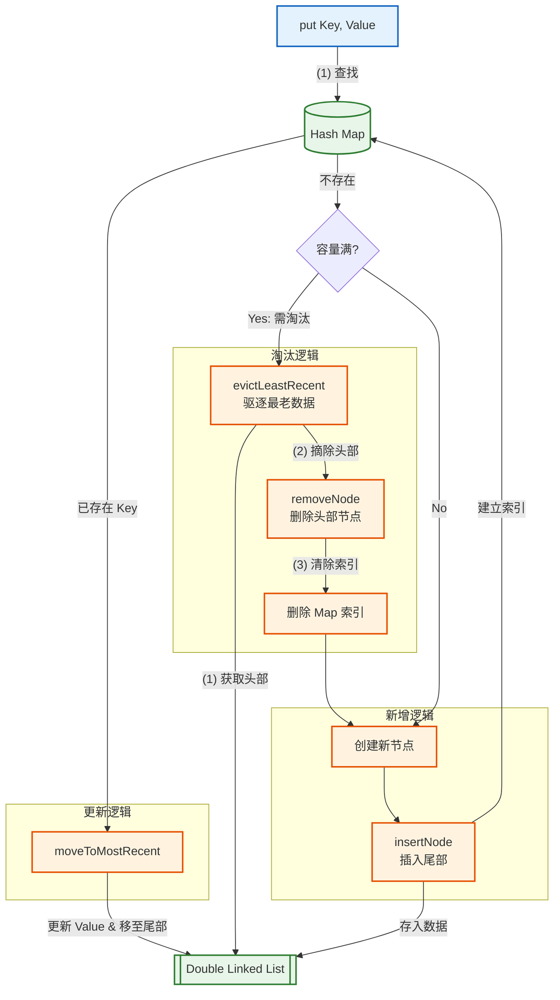
#### 关于LRU-K与HashLRU的实现
##### LRU-K
`LRU-K`采用了`继承 (Inheritance)` + `组合 (Composition)`的实现方式，继承了LRU的内容框架，同时外部组合维护了`historyList_`与`historyValueMap_`，记录K次访问历史，解决缓存污染问题。
###### LRU-K流程图
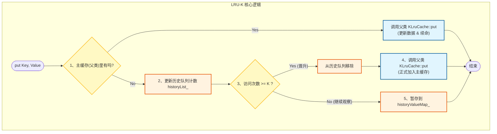
###### 如何组合
**`1.historyList_`**
复用了`KLruCache`结构，构造了访问计数器：`std::unique_ptr<KLruCache<Key, size_t>> historyList_;`定义了一个缓存，且这个缓存是`KLruKCache`的独占指针。
**为什么使用`unique_ptr`**？
1. **独占所有权 (Ownership)**：`std::unique_ptr` 明确表达了 `KLruKCache` 拥有这个 `historyList_`。无需手动 `delete`，生命周期自动管理 (RAII)。
2. **隐式禁用拷贝 (Copy Prevention)**：
    - `unique_ptr` 是**不可拷贝**的。
    - 只要成员变量里包含 `unique_ptr`，编译器就会**自动删除** `KLruKCache` 的拷贝构造函数和赋值操作符。
    - **好处**：防止缓存对象被意外深拷贝（Deep Copy），这对于包含大量数据的缓存类来说是巨大的性能陷阱。
3. **动态重置 (Flexibility)**：
    - 如果是普通对象成员，很难重新构造。
    - 使用指针，如果未来需要调整历史队列容量，可以直接 `historyList_.reset(new KLruCache(...))`。
**`2.historyValueMap_`**
构造一个小缓存，用于存储为达到k次访问的数据值，增加读取速度。
##### Karma代码中LRU-K实现出现的问题 -> 可优化点
由于Karma在实现LRU-K时，复用`KLruCache`类实现`historyList_`，因此在缓存大小设置错误、高频访问高频修改的情形下，会造成内存泄露、饥饿问题。下面分类讨论。
**场景1 高频只读不写**
- **场景**：用户调用 `get(key)`，但从未调用过 `put(key, value)`。
- **流程**：
    1. `historyList_` 会记录这次访问，`count` 增加。
    2. 但是 `historyValueMap_` 只有在 `put` 时才会被写入。
    3. 当 `get` 调用次数达到 k 时，代码尝试从 `historyValueMap_` 找值，自然找不到。
- **结论**：这是符合逻辑的。系统记录了“访问意图”，但因为没有实际数据，所以无法晋升。
**场景2 外层试用期饿死**
如果 `historyCapacity`（历史队列容量）设置得过小，会发生**严重问题**。
- **现象**：
    1. 新数据 A 进入 `historyList_`，count=1。
    2. 大量新数据 B, C, D... 涌入。
    3. 由于 `historyList_` 容量有限，A 还没来得及被访问第 2 次，就被 LRU 淘汰了。
    4. 下次 A 再来，计数器重置为 1。
- **后果**：所有数据都在历史队列里不断的“进入->被踢”，**永远无法达到 K 次阈值**，导致主缓存一直为空。
- **解决方案**：`historyCapacity` 通常需要设置得比主缓存大很多（例如 2x~5x），因为它只存计数，开销较小。
**场景3 高频切换 洗刷外层缓存**
`historyList_` 和 `historyValueMap_` 的**不同步**，导致了**内存泄漏**。
- **问题描述**：
    - `historyList_` 是一个独立的 `KLruCache` 对象。当它容量满时，会自动驱逐 Key。
    - **但是**，`KLruKCache` (外层类) **并不知道** `historyList_` (内层对象) 驱逐了哪个 Key。
    - 结果：Key 从 `historyList_` 中消失了，但它的 Value 依然残留在 `historyValueMap_` 中。
- **后果**：`historyValueMap_` 会**无限增长**，直到内存耗尽 (OOM)，因为它没有驱逐策略，且失去了与 LRU 队列的同步。
##### HashLRU
`HashLRU`没有继承`KLruCache`，而是直接在类内定义了分片的`KLruCache`，外部通过将`key`进行hash处理得到分片索引，从而完成分片的选择，达到**分治**的目的。减少了锁的颗粒度，可以应对多线程高并发情形下的锁阻塞问题。
###### HashLRU流程图
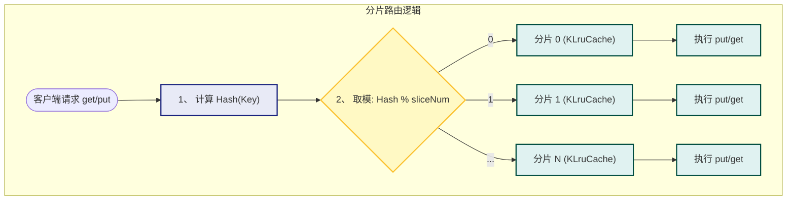
##### 优化方法优劣对比
| 特征            | KLruKCache (LRU-K)                                                                                               | KHashLruCaches (分片 LRU)                                                                                                                               |
| ------------- | ---------------------------------------------------------------------------------------------------------------- | ----------------------------------------------------------------------------------------------------------------------------------------------------- |
| **核心目标**      | **“防御”** (防污染、保命中率)                                                                                              | **“进攻”** (高并发、高吞吐)                                                                                                                                    |
| **优点 (Pros)** | 1. **抗全量扫描**：保护热点数据。<br><br>2. **智能淘汰**：基于访问频率 (Frequency)，比纯时间更准。                                               | 1. **极低锁竞争**：多线程并行度高，性能随核数线性增长。<br><br>2. **结构简单**：代码复杂度低，易于理解和调试。                                                                                    |
| **缺点 (Cons)** | 1. **内存翻倍**：需维护历史队列 + 暂存 Map。<br><br>2. **延迟增加**：操作路径变长，两次 Map 查找。<br><br>3. **实现风险**：Map 与 List 不同步易导致 **OOM**。 | 1. **Hash 倾斜**：热点 Key 集中可能打爆单个分片。<br><br>2. **伪 LRU**：丧失全局 LRU 语义，淘汰不完全公平。<br><br>3. **接口断层**：未继承基类，无法多态复用。<br><br>4. **Crash 风险**：代码中存在 `memset` 误用。 |
| **适用场景**      | 数据库 Buffer Pool、文件系统缓存 (存在扫描操作)                                                                                  | Web 服务器 Session 缓存、高频 API 缓存 (并发极高)                                                                                                                   |
### KLfuCache.h
#### 内容
实现了`LFU`算法（最近最少使用）,同时利用分治的方法，外部维护了HashMap，提高了基础LFU算法的吞吐量，减小了锁的粒度。
#### LFU
##### 流程图
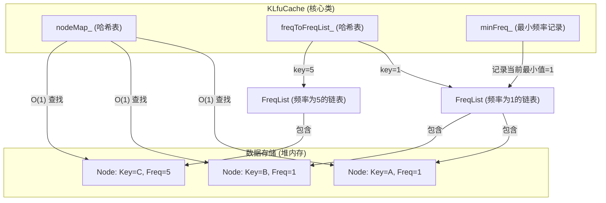
##### `put`逻辑
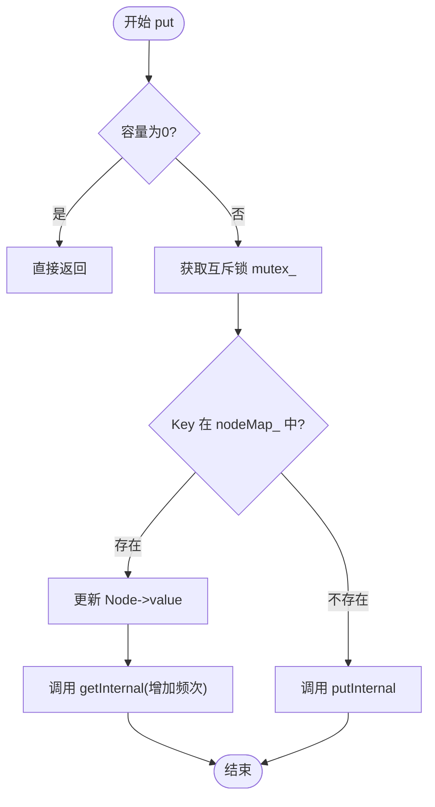
`put`调用的子函数
- `getInternal`：当 Key 已存在时，`put` 实际上退化为了“更新值 + 增加频率”。复用 `getInternal` 可以避免代码重复。
- `putInternal`：处理真正的插入逻辑。隔离了“锁”的逻辑和“插入”的逻辑。
- `kickOut`       ：**核心淘汰逻辑**。找到 `freqToFreqList_[minFreq_]` 链表，删除头节点。这是 LFU 腾位置的关键步骤。
- `addToFreqList`：将新节点挂载到 `freq=1` 的链表末尾。
- `addFreqNum`  ：
	1. 增加总访问次数。
	2. 计算平均热度，如果过热（频数过高），触发**老化机制 (`handleOverMaxAverageNum`)**。
##### `get`逻辑
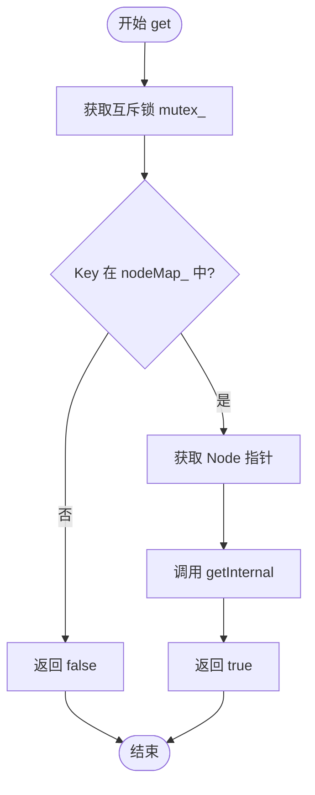
`get`调用子函数
- `getInternal`：封装了“晋升”的所有细节。`put` (更新时) 和 `get` 都会用它。
- `removeFromFreqList`：从当前的 `FreqList` 中摘除节点。如果摘除后链表空了，可能触发 `minFreq_` 的变化。
- `addToFreqList`：将节点加入到 `freq + 1` 的对应的 `FreqList` 中。如果该频率的链表不存在，会动态 `new` 一个出来。
- `addFreqNum`：同样用于更新访问统计，即使是读取操作，也算作系统的一次活跃，可能会触发老化检查。
##### 管理hash与频次链表
与外部的`put`与`get`接口逻辑相对的，是真正管理内部频次hashmap与指针链表的`getInternal`与`putInternal`。
`getInternal`:表面是查找逻辑，实际也负责数据的更新频次业务（从低频层级流向高频层级），与高频触发保护业务。
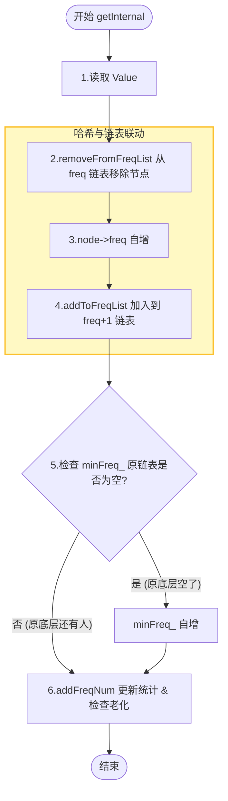
`putInternal`：准入与淘汰 (Admission & Eviction)，这个函数只在 **Key 不存在** 时才会被调用。它的核心任务是 **处理容量** 和 **初始化新数据**。
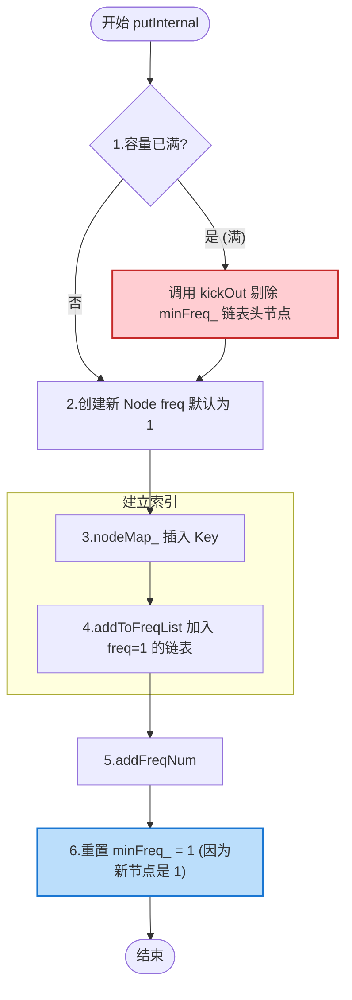
|**特性**|**getInternal (晋升)**|**putInternal (插入)**|
|---|---|---|
|**触发场景**|读数据，或更新已存在的数据|**仅限** 插入全新数据|
|**minFreq_ 的变化**|**可能增加** (底层的被提拔光了)|**强制重置为 1** (来了新的数据，有了最低频次的链表)|
|**对链表的操作**|**移动** (从 List A 摘除 -> 放入 List B)|**新增** (直接放入 List A)|
|**内存开销**|**无新分配** (复用现有 Node)|**new** (分配新 Node 内存)|
|**危险性**|**低** (只是指针操作)|**高** (如果不执行 kickOut 会内存溢出)|
##### 访问爆炸问题
**现象**
- 频率爆炸：对于长期驻留在缓存中的热数据，频率计数可能会无限增长，占用额外的存储空间或导致计数溢出。
- 过时热点数据占用缓存：一些数据可能已经不再是热点数据，但因访问频率过高，难以被替换。
**解决方案**
`handleOverMaxAverageNum（）`
引入最大平均访问次数，当当前平均值大于最大平均访问次数时，将所有的访问次数减去一个固定值：即**全员降级（Aging / Decay）**，这种做法对于不再访问的高频数据，将会进行持续清洗，直至被降级删除。
**流程图**
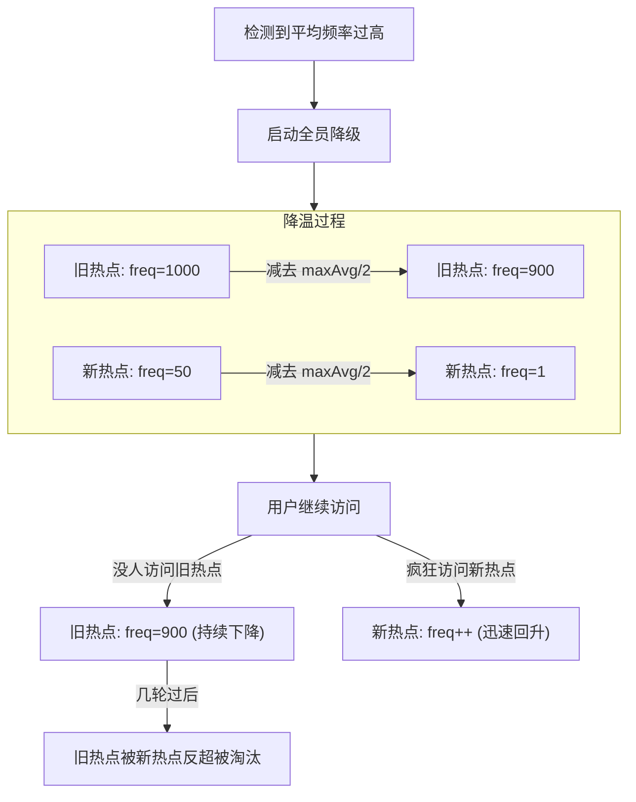
**解决问题**
引入了**降级机制**后，优化了基础LFU的如下问题：
-  频率爆炸问题：对于长期驻留在缓存中的热数据，频率计数可能会无限增长，占用额外的存储空间或导致计数溢出。
- 过时热点数据占用缓存：一些数据可能已经不再是热点数据，但因访问频率过高，难以被替换。
- 冷启动问题：刚加入缓存的项可能因为频率为1而很快被淘汰，即便这些项是近期访问的热门数据。
- 不适合短期热点：LFU对长期热点数据表现较好，但对短期热点数据响应较慢，可能导致短期热点数据无法及时缓存。
- 缺乏动态适应性：固定的LFU策略难以适应不同的应用场景或工作负载。
#### HashLFU
`KHashLfuCache` 本质上是一个 **路由器（Router）** 或 **分发器（Dispatcher）**。它不负责具体的淘汰逻辑，只负责把流量分发给手下的“打工仔” (`KLfuCache`)。
##### 原理
**初始化：**
- **输入**：总容量 `Capacity` = 1000，分片数 `SliceNum` = 4。
- **动作**：创建 4 个独立的 `KLfuCache` 实例。
- **结果**：每个实例分到的容量是 $1000 / 4 = 250$。
**运行时：**
- **输入**：`put("UserA", data)`
- **哈希计算**：`hash("UserA")` 得到一个大整数，例如 9999。
- **取模定位**：`9999 % 4 = 3`。
- **分发**：直接调用 **第 3 号** `KLfuCache` 的 `put` 方法。
##### 流程图
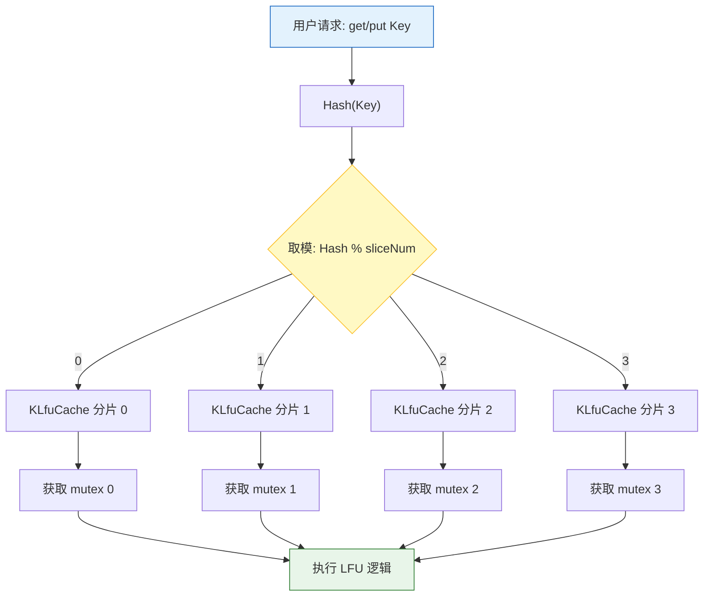
##### 一些代码知识点
**为什么是emplace_back**
1. 性能优化：`emplace_back` 支持**原位构造（In-Place Construction）**。
   如果使用 `push_back`：
	- **构造临时对象**：在外部先构造一个 `std::unique_ptr` 临时对象（包裹着 `new` 出来的指针）。
	- **移动构造**：将这个临时对象 **Move (移动)** 到 `vector` 尾部的内存空间中。
	- **析构临时对象**：销毁那个临时的 `unique_ptr` 空壳。
   如果使用`emplace_back`：
	- **直接构造**：`emplace_back` 直接拿到参数（即 `new` 出来的原生指针），直接在 `vector` 尾部的内存地址上调用 `unique_ptr` 的构造函数。
2. 规避显示构造函数`explicit`
   `lfuSliceCaches_` 存储的是 `std::unique_ptr`。请注意，`std::unique_ptr` 接受原生指针的构造函数是 **`explicit` (显式的)**。这意味着编译器**不允许**隐式地将原生指针转换为智能指针。
   如果需要使用`push_back`来构造分片数组，需要写成
```cpp
// 必须显式调用构造函数
lfuSliceCaches_.push_back(
    std::unique_ptr<KLfuCache<Key, Value>>(new KLfuCache<Key, Value>(sliceSize, maxAverageNum))
);
// 同时也可以写成make_unique，对应了智能指针的维护问题
lfuSliceCaches_.push_back(
	std::make_unique<KLfuCache<Key, Value>>(sliceSize, maxAverageNum));
```
综上所述，对于`std::vector<std::unique_ptr<T>>`这一数组的模板类数组初始化定义，
- **写法 A (`emplace_back` + `new`)**：省去移动，但在 vector 内存不足需要扩容且抛出异常时，这裸露的 `new` 出来的指针可能会泄漏（极其极端的情况）。
- **写法 B (`push_back` + `make_unique`)**：这是最推荐的 **Safe** 写法。虽然多了一次移动（Move），但 `unique_ptr` 的移动成本极低，且 `make_unique` 保证了即使发生异常也不会内存泄漏。
**`purge`的使用**
在这份代码中，`purge`只清除了`nodeMap_`与`freqToFreqList_`内的键值对，但由于在之前的创建节点中，创建节点代码为：
```cpp
// 使用 new 在堆上分配内存
freqToFreqList_[node->freq] = new FreqList<Key, Value>(node->freq);
```
因此在调用`clear`函数清空`freqToFreqList_`这一hashmap时，只会清除键值对，但不会释放指针。
因此可以改进为：
```cpp
std::unordered_map<int, std::unique_ptr<FreqList<Key, Value>>> freqToFreqList_;
```
利用智能指针进行管理，因此情况键值对的同时会自动析构指针。
### KArcCache.File
#### ArcLRU
**特点**
加入幽灵缓存，避免热点在初始情况就被清除
#### 执行过程剖析

1. 整个Cache分为两部分，LRU和LFU各占一半，根据不同的访问模式动态适应调整`partition`分割指针的位置（也就是动态调整lfu和lru的大小），除此之外，LRU和LFU各自有一个`ghost list`（淘汰链表，分别用于存储从LRU和LFU中淘汰的数据）。
2. 在缓存中查找客户端需要访问的数据，如果没有命中，表示缓存穿透，将需要访问的数据从从磁盘中取出，插入缓存中的`LRU`部分对应链表的尾部（ps：头插和尾插没有区别，看个人习惯）。
3. 如果命中（LRU部分存在该数据）且LFU链表中没有则判断该数据的访问次数是否大于`transformTime_`（自定义的变量，我这里设置为3，代表访问次数超过3次），若大于则将该数据插入`LFU`对应链表中（一个块至少需要读取`transformTime_`次，并且要是最近请求的数据，才会被存储到`LFU`中）。于是，该数据块不仅仅只保存在LRU的缓存目录中，也将保存到LFU中。如果命中且LFU链表中存在，则将数据重新放入LFU链表中对应位置（访问频次计数+1），这样，那些真正被频繁访问的页面将一直呆在缓存中，不会被冷数据的加入而误淘汰，不经常访问的数据会向链表头部移动，最终被淘汰出去。
4. 如果此时`LRU`缓存满了，则从`LRU`链表中淘汰表头部的数据，将淘汰数据的`key`放入`LRU`对应的`ghost list`。然后在`LRU`的链表尾部添加新数据。如果`ghost list`的元素满了，按照先进先出的方式淘汰`ghost list`中的元素头部元素，然后再从尾部插入元素。
5. 如未命中缓存的数据根据key发现在LRU对应的`ghost list`中，则表示幽灵命中，缓存系统就可以知道，这是一个刚刚淘汰的页面，而不是第一次读取或者说很久之前读取的一个页面。于是根据这个信息来调整内部的`partition`分割指针以适应当下的访问模式。上述迹象说明当前的`LRU`缓存太小了，于是将`partition`分割指针右移一位(也就是`LRU`缓存空间+1，`LFU`缓存空间-1），并将命中的`key`数据从`ghost`的中移除，将新数据从LRU链表尾部插入。
6. 反之如果未命中缓存的数据根据key发现在LFU对应的ghost中，则说明当前访问模式偏向于频繁访问经常被访问的那一些数据，说明当下LFU缓存空间太小了，对应`partition`分割指针左移一位，并将命中的`key`数据从`ghost`的中移除，将新数据从LRU链表尾部插入。
#### 流程图
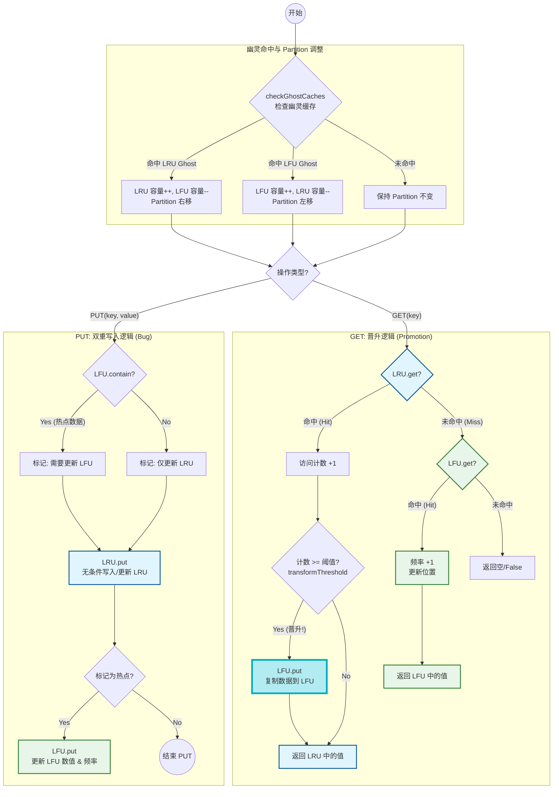
#### 我的理解
##### 可优化点1
对于卡哥的代码，他在ARC中采用了双重保存逻辑：
	当写入函数命中LRU的同时也会更新LFU，即一份数据会被同时保存在LRU与LFU中；访问函数`get()`维护了晋升逻辑，即访问数据过高就会将数据晋升到LFU当中，但LRU中不删除。
根据卡哥的逻辑，会出现如下情景：
- **晋升阶段**：
    - 数据 `Key A` 被频繁访问，满足阈值。
    - 根据描述，它被**复制**到了 LFU。
    - **当前状态**：`Key A` 在 LRU 中（作为老数据），同时也在 LFU 中（作为热数据）。
- **LRU 淘汰阶段**：
    - 随着新数据不断涌入 LRU，LRU 空间满了。
    - `Key A` 在 LRU 链表中被挤到了尾部（尽管它在 LFU 里很热，但在 LRU 这个副本里它可能变冷了，或者仅仅是因为 LRU 满了）。
    - **触发淘汰**：`Key A` 从 LRU 主缓存移除，进入 **LRU Ghost List (B1)**。
    - **当前状态（Bug 现场）**：
        - **LFU Main**：包含 `Key A`（可以正常读取）。
        - **LRU Ghost**：包含 `Key A`（标记为“最近从 LRU 淘汰”）。
- **冲突爆发（再次访问 Key A）**：
    - 客户端请求读取 `Key A`。
    - **逻辑判定 1（Ghost 检查）**：系统先检查 `checkGhostCaches`。发现 `Key A` 在 LRU Ghost 中
    - **系统推断**：根据`checkGhostCaches`判断，是LRU空间小了，淘汰了最近最久未被访问数据
    - **系统行为**：**扩大 LRU，压缩 LFU**。
这完全与ARC相悖，明明LFU保护了实时热点数据，但是还是被幽灵缓存惩罚，减少了空间。
##### 可优化点2
同时，卡哥将LRU->LFU的晋升逻辑维护在`get()`访问函数中，而`put()`函数仅用于更新。
如果出现**写多读少**的情况，将会有如下情景：
假设有一个 Key "Config_A"，我们将对它进行 100 次 `put` 操作（更新配置），中间没有任何 `get`。
- **第 1 次 put**：插入 LRU，`accessCount` = 1。
- **第 2 次 put**：命中 LRU，更新 Value，移动到头部。**`accessCount` 依然是 1**。
- **...**
- **第 100 次 put**：命中 LRU，更新 Value，移动到头部。**`accessCount` 还是 1**。
**结果**：尽管 "Config_A" 热得发烫，是系统中最活跃的数据，但它**永远**无法满足 `accessCount >= 2` 的晋升条件。它只能在 LRU 队列里打转。一旦 LRU 满了，它甚至可能因为暂时没被写而被淘汰。
**LFU 部分彻底闲置**：因为没有数据能晋升进来，LFU 区域将一直为空（或者只包含那些偶尔被 `get` 读到的数据）。整个缓存系统变成了纯粹的 LRU。
**特殊情况**：如果一直用不同的数据触发`put()`函数，那么LRU的幽灵缓存将会被填满，而且被不断命中，导致整个ARC从空间上、逻辑上都被退化成LRU，LFU不会被触发。
#### 我的优化
为了解决上面两个问题，需要优化两个方面：
- **解决“双重存储”**：通过 `优先判断 LFU -> 更新 -> return` 的逻辑，保证了数据互斥性。
- **解决“ARC 退化”**：通过在 `put` 中补全晋升逻辑，让写密集型业务也能触发数据从 LRU 流向 LFU。
##### 优化后ARC流程图
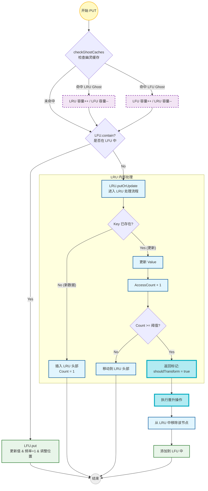